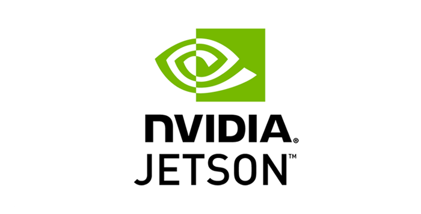

# Smoker Detection for Jetson Nano USB Camera

 

)

  

<!-- PROJECT LOGO -->
 

  

## Smoker Detection for Jetson Nano USB Camera

  

    A basic project to deploy a smoker detection application on a Jetson Nano (4GB), using the Jetson-Interface libraries as well as the Roboflow Docker container with a model that I trained, but all running locally. The basics are as follows:
    The USB camera streams to the initial model to detect a person which then captures the image and sends to the pre-trained model running on the roboflow docker image and checks for the appearance of a cigarette. If a cigarette is detected the model writes "Potential Smoker" to the image and saves it in the Smoking folder for later viewing. If the person is not smoking, the image is deleted from the capture directory.
     

  

  

    I am aware that this could be further optimized from every Nth frame check to further training the model on Roboflow. My intention was not for perfection but rather for demonstration that this and other CV projects can be developed and deployed on the Jetson architecture. Feel free to fork and build on making this even faster and more accurate. This project uses a containerized cigarette detection model trained on a roboflow platform using a public dataset (<a href="https://universe.roboflow.com/mike-ovbzu/smoking-detection-08o4g/dataset/2">Model and Dataset</a>).
     
  

<!-- REQUIREMENTS -->
## Requirements

Below are the recommended hardware requirements for this project. I have selected the 128GB microSDXC based on the size of the libraries and dependencies.

<ol>
<li>NVIDIA Jetson Nano Developer Kit (945-13450-0000-100)</li>
<li>SanDisk Ultra microSDXC 128GB 100MB/s SDSQUNR 128G GN6MN</li>
</ol>

<!-- GETTING STARTED -->
## Getting Started

In order to get this project up and running it is assumed that you have already flashed and set up the Ubuntu desktop environment.
### Check Swap space 
>> free -m 
>> sudo systemctl disable nvzramconfig 

### Create 4GB swap file 
>> sudo fallocate -l 4G /mnt/4GB.swap 
>> sudo chmod 600 /mnt/4GB.swap 
>> sudo mkswap /mnt/4GB.swap 

### Append the following line to /etc/fstab 
>> sudo su 
>> echo "/mnt/4GB.swap swap swap defaults 0 0" >> /etc/fstab 
>> exit 
### Update again and reboot
>> sudo apt-get update 
>> sudo shutdown -r now 

<!-- USAGE EXAMPLES -->
## Set Up

  

    Get an account on (<a href="https://roboflow.com/" target="_blank">RoboFlow.com</a>), you will need this to use the inference call.
Once you set up an account locate your API key.
     
    <ol>

<li> Get an API key from roboflow.com</li>
<li> Replace the <API KEY> in the smoking_detection.py file with your API Key</li>
<li> Do not forget to save the file after editing.</li>
<li> Now you need to give the scripts the correct permissions to be able to run on the Jetson Nano.</li>
<li> Navigate to the directory containing the (max.sh and the start_smoking_container.sh) files.</li>
<li> Open a terminal in that directory and run the following commands.</li>
>> sudo chmod u+x installs.sh
 
>> sudo chmod u+x max.sh
   
>> sudo chmod u+x start_smoking_container.sh
<li> Now that your scripts can be ran start all of the required installs by running the following:</li>
>> sudo ./installs.sh
<li> When prompted with configuration file question: type "N" both times.</li>
<li> You will be prompted to automatically restart the Docker Daemon, click "No".</li>
<li> You may get asked if you want to install certain libraries etc, type Y and let run.</li>
<li> When you get to the Models options window, please be sure to select (ssd-mobilenet-v2) Under the Object Detection heading.</li>
<li> When you get to the Pytorch installation screen select it and Tab to "Ok".</li>
<li> The overall time of implementation can vary depending on internet speeds and other factors. It usually takes around 30 minutes.</li>

<li> Upon completion your Nano should reboot.</li>
  

</ol>

<!-- Start Up -->
## Start Up

  

    Once the install finish and the Nano reboots you can test the application as follows:
     
    <ol>
<li> Log back into the device.</li>
<li> Navigate to the root folder of the project.</li>
<li> First we will boost the performance of the Nano.</li>
<li> Open a terminal and enter the following:</li>
>> boost clocks
 
>> sudo ./max.sh
  <li> Now we will start the Smoking detection Docker Container:</li>
>> sudo ./start_Smoking_container.sh
<li> Now open another terminal in the same directory and enter the following:</li>
>> python3 smoking_detection.py
  <li>The initial run may take a few minutes to load and start inferencing based on the Docker container as well as the 2 models the stream runs through. Remember initially we need to detect that a person is there, then we detect if that person has a cigarette.</li>
</ol>

Your display should resemble the images below. Be sure to check the "Smoking" directory for any captured images of smokers.

Smoker Detected           |  Smoker Detected
:-------------------------:|:-------------------------:
![A1] |  ![B2]  

Smoker Detected           |  Smoker Detected
:-------------------------:|:-------------------------:
![C3] |  ![D4]  

<!-- Process Diagra -->
## Process Diagram

  

    Below is a simple flowchart depicting the flow of the project where you see the 2 distinct methods for inference on the Nvidia Jetson Nano.
     

![D5]

<!-- CONTACT -->
## Contact

Project Link: [https://github.com/mstatt/Nvidia_Jetson_Smoker_Detection]

Nano Certification URL:
https://courses.nvidia.com/certificates/a19429d0545b4aa6b209074ed314e5ce

Project Video:
https://www.youtube.com/watch?v=EPocYfeyTr8

(<a href="#top">back to top</a>)

<!-- LICENSE -->
## License

<!-- MARKDOWN LINKS & IMAGES -->
[license-shield]: assets/68747470733a2f2f696d672e736869656c64732e696f2f6769746875622f6c6963656e73652f6f74686e65696c647265772f426573742d524541444d452d54656d706c6174652e7376673f7374796c653d666f722d7468652d6261646765.svg?style=for-the-badge
[license-url]: https://github.com/mstatt/Emotion_Detection/blob/main/LICENSE.txt
[demo-url]: https://www.youtube.com/watch?v=AWB2cEKcME0

[A1]: assets/1.jpg
[B2]: assets/2.jpg
[C3]: assets/3.jpg
[D4]: assets/4.jpg
[D5]: assets/flow.png
